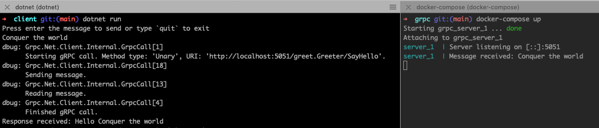

# gRPC test

*Disclaimer: I'm not a C++ expert.*

This is a quick test using a .NET application acting as client and a C++ application as server in a Docker container.

How to run it?

1. Clone the project
2. In one tab, run `docker-compose up`. It will take some time to build the local Docker image in the first time. 
3. In another tab, run `cd client && dotnet run`

In the second tab (.NET app), type any message and press enter. It sends the message to the server which responds to the client. Press CTRL+C to exit.

**Dockerfile**

It clones and builds the C++ gRPC library used by the server application. The heaviest and longest build is the C++ gRPC library.

**Note**

1. You will need memory to build the image. I had to increase the RAM to 4GB in Docker Desktop settings.